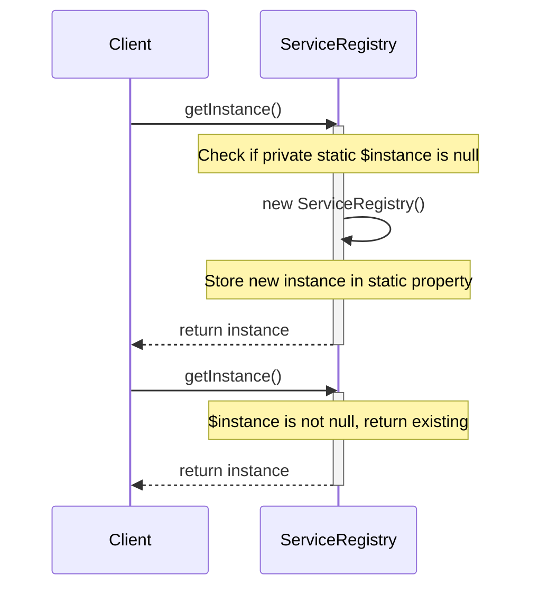
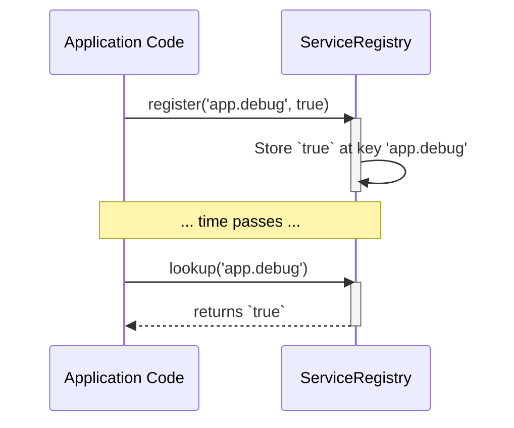
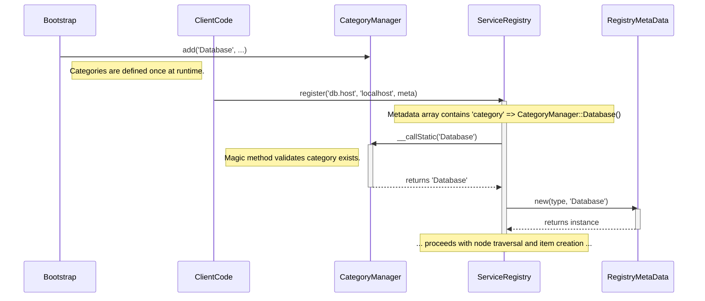
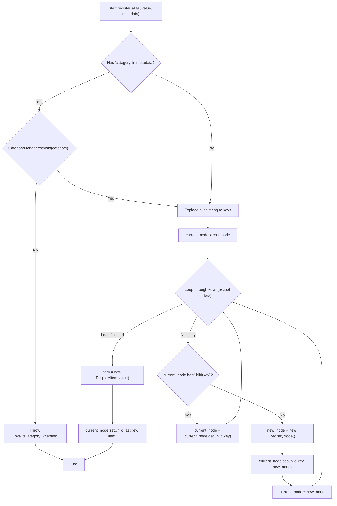
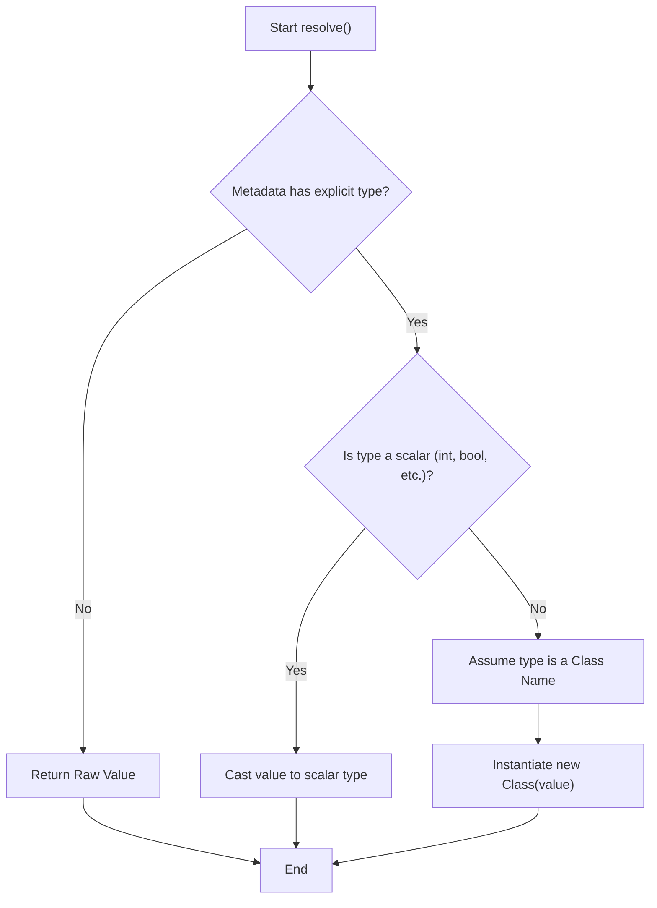

# Registry Package Design Diagrams

This document provides detailed design diagrams for the core processes of the registry package.

---

## 1. Singleton Instance Creation

This sequence diagram shows how the `getInstance()` method ensures that only one instance of the `ServiceRegistry` is ever created, enforcing the Singleton pattern.

---

## 2. Data Flow (Register & Lookup)

This sequence diagram illustrates the two fundamental operations of the registry: writing data via `register()` and reading it back via `lookup()`.

---

## 3. Category Validation & Registration Flow

This sequence diagram shows the complete flow of how the `CategoryManager` is used. First, a category is defined during application bootstrap. Later, when client code calls `register()`, the `ServiceRegistry` uses the `CategoryManager`'s magic `__callStatic` method to validate the category and retrieve its canonical name before creating the `RegistryMetaData`.

---

## 4. Alias Parsing & Node Generation

This flowchart visualizes the internal logic of the `register()` method. It shows how a dot-notation alias is parsed to traverse and, if necessary, create the `RegistryNode` object graph.

---

## 4. Value Resolution (Hydration)

This flowchart shows the logic of the `resolve()` method, which transforms a raw stored value into its final, usable form based on the instructions in its `RegistryMetaData`.

