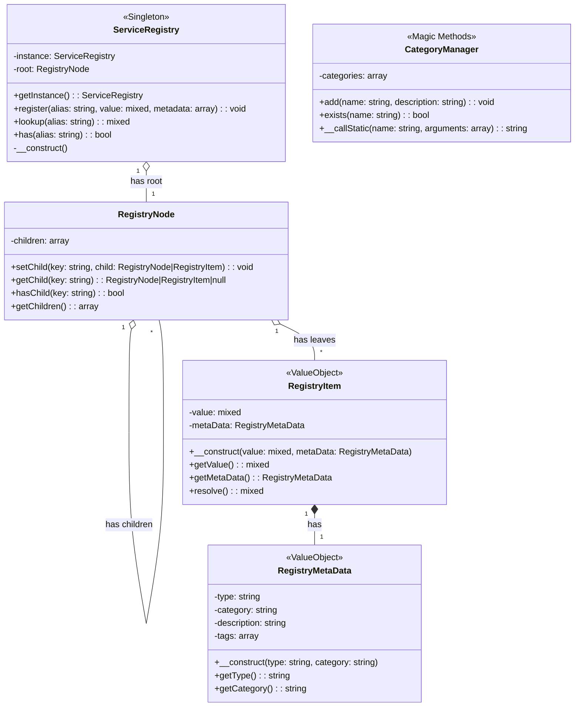

# Registry Planning Document

## 1.0 Overview

### 1.1 Vision

To create a robust, standalone, and PSR-compliant PHP registry package based on OOP principles outlined in docs/references/ref-registry.md.

## 2.0 Features

### 2.1 Core Features

## 3.0 Directory Structure

```
.
│
├── src/
│   ├── Components/
│   │   ├── RegistryNode.php
│   │   ├── RegistryItem.php
│   │   └── RegistryMetaData.php
│   │
│   └── ServiceRegistry.php
│
├── tests/
│   ├── main.php
│   └── ...
│
├── composer.json
├── README.md
├── PLAN.md
└── TODO.md

```

## 4.0 Component Class Diagrams

This section contains the Mermaid class diagram for the core components of the PHP Registry package.


