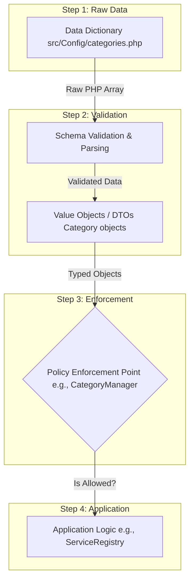

# Sketch: Data Flow from Dictionary to Enforcement

This document sketches the flow of data from its raw definition in a data dictionary, through object-oriented structuring (DTOs), to its use in a Policy Enforcement Point (PEP).

We will edit this flowchart as we refine the architecture.

### Flow Explanation

*   **A. Data Dictionary**
    *   This is the single source of truth. It's a simple, data-only file (`categories.php`) that defines the schema in a raw format (a PHP array). It contains no logic.

*   **B. Schema Validation & Parsing**
    *   This is a critical step that acts as a gatekeeper. A dedicated parser or manager class reads the raw array from the Data Dictionary.
    *   It then uses a validation method (like a Schema Library or a series of checks) to assert that the array's structure and values conform to the expected schema.
    *   If validation fails, the process stops here with an error. If it succeeds, the process moves to the next step.

*   **C. Value Objects / DTOs**
    *   Once the data is validated, it is immediately converted from a raw array into strongly-typed, immutable objects (DTOs or Value Objects like a `Category` class).
    *   From this point forward, the rest of the application interacts with these clean, predictable, and type-safe objects, not the raw array.

*   **D. Policy Enforcement Point (PEP)**
    *   This is a service (e.g., `CategoryManager`) that holds the collection of DTOs created in the previous step.
    *   It provides a simple, high-level API (e.g., `isValidCategory('database')`) to the rest of the application. It encapsulates the logic of searching and checking the loaded data.

*   **E. Application Logic**
    *   This is the consumer of the PEP. A class like `ServiceRegistry` doesn't know about the config file or the DTOs. It simply asks the PEP for a policy decision ("Is this metadata key allowed for this category?").
    *   This decouples the business logic from the data source, validation, and internal data structures.