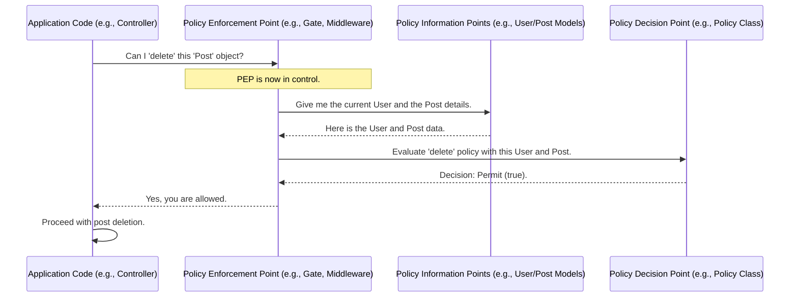
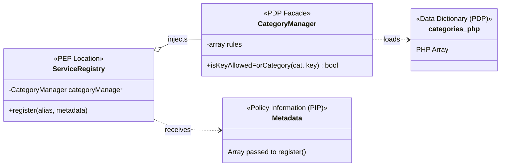
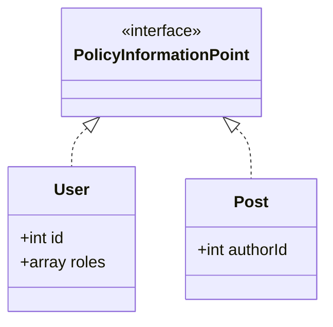
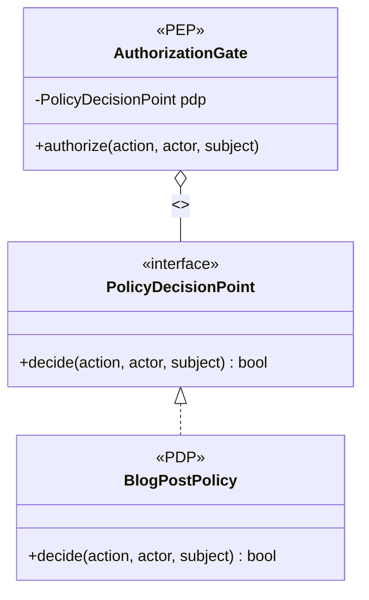

# Reference: Authorization Concepts (PDP, PIP, PEP)

This document summarizes the architectural concepts of the Policy Decision Point (PDP), Policy Information Point (PIP), and Policy Enforcement Point (PEP).

## 1. What are PDP, PIP, and PEP?

These terms, formalized by the XACML standard, describe distinct roles within an authorization system. Understanding their separation is key to building robust applications.

*   **PDP (Policy Decision Point):** The brain of the operation. This is the ultimate source of truth that defines the policy rules. It is the component that makes the final decision.
    *   *Analogy:* The club owner who writes the guest list and the rules (e.g., "no sneakers, members only").
    *   *In Code:* The `PostPolicy` class, the logic inside a `Gate::define()` closure, or your `categories.php` file.

*   **PIP (Policy Information Point):** The source of information needed to make a decision. These are your data objects and application state.
    *   *Analogy:* The guest's ID, their membership card, and their attire.
    *   *In Code:* The currently authenticated `User` object, the `Post` model being evaluated, the current time, the user's IP address.

*   **PEP (Policy Enforcement Point):** The bouncer at the door. This is the component that actually enforces the policy. It guards a resource or action, asks the PDP for a decision, and then acts on that decision.
    *   *Analogy:* The bouncer who checks the ID against the guest list and either opens the rope or denies entry.
    *   *In Code:* An `AuthMiddleware`, the `Gate::allows()` method, or a `can()` check in a controller.

## 2. Standard vs. Pattern: XACML in PHP

PHP frameworks do **not** implement the formal, heavyweight XACML standard directly. The XML-based nature of the standard is often seen as too cumbersome for most web development.

However, PHP frameworks **absolutely follow the XACML architectural pattern**. The concepts of separating policy, information, and enforcement are fundamental to modern best practices.

For example, Laravel's `Gate` maps perfectly:
- **PDP:** The `AuthServiceProvider` where `Gate::define()` rules are written.
- **PIP:** The `User` and `Post` models passed to the gate.
- **PEP:** The `Gate::allows()` method or the `can:` middleware.

## 3. How They Interact: The "Hub and Spoke" Model

The components are **not** implemented in a simple chain. Doing so would create a tightly-coupled system. Instead, they interact in a **hub-and-spoke** model where the **PEP is the central hub**.

This interaction model is a critical best practice because it decouples the components.

1.  An action is attempted in the application (e.g., a controller method).
2.  The application code calls the **PEP** to check for permission.
3.  The **PEP** gathers the necessary data from the **PIPs** (e.g., the current user, the target resource).
4.  The **PEP** consults the **PDP**, passing it the information from the PIPs to get a decision.
5.  The **PDP** evaluates its rules and returns a simple "Permit" or "Deny" decision to the PEP.
6.  The **PEP** enforces the decision, either by letting execution continue or by stopping it (e.g., throwing a 403 exception).

### Interaction Flowchart

This sequence diagram shows the PEP acting as the central orchestrator.



## 4. Why This Structure is a Best Practice

Separating these roles is fundamental to good software design:

*   **Single Responsibility Principle (SRP):** Each component does one job, making the system easier to understand and maintain.
*   **Flexibility:** You can change the policy rules (PDP) without ever touching the enforcement logic (PEP).
*   **Testability:** Each component can be unit-tested in isolation.

## 5. OOP Implementation: Dependency Injection

The ideal OOP relationship for these components is **Dependency Injection**. The class containing the PEP (e.g., `ServiceRegistry`) should not create its dependencies. Instead, the PDP facade (e.g., `CategoryManager`) is passed into, or "injected" into, the PEP's class, usually via the constructor.

This is a best practice for several reasons:

1.  **Decoupling:** The `ServiceRegistry` doesn't know *how* the `CategoryManager` gets its rules. It only knows that it has an object that can answer the question "Is this allowed?".
2.  **Testability:** When you unit-test the `ServiceRegistry`, you can easily inject a "mock" `CategoryManager` that returns `true` or `false` on command. This allows you to test the PEP's logic in complete isolation.
3.  **Flexibility:** If you ever change how you store your policies (e.g., moving from a file to a database), you only need to write a new Manager class. The `ServiceRegistry` code doesn't change.

### Simple Schematic of the Interaction

A class diagram is the perfect way to visualize this OOP relationship.



**What this schematic shows:**

1.  **`ServiceRegistry` has a `CategoryManager`:** The solid line with the circle (`o--`) shows that `ServiceRegistry` has a reference to a `CategoryManager` instance. This is the dependency injection.
2.  **`CategoryManager` loads `categories.php`:** The dotted line (`..>`) shows that the `CategoryManager` depends on and loads its rules from the `categories.php` file (the PDP).
3.  **`ServiceRegistry` receives `Metadata`:** The `ServiceRegistry`'s `register` method receives the metadata array (the PIP) as an argument, which it will then ask the `CategoryManager` to validate.

## 6. Abstract PHP Implementation Contracts

While specific implementations vary, we can define a set of interfaces to represent the abstract roles of PDP, PIP, and PEP. This helps in creating a clean, type-safe, and decoupled authorization system.

### a) The Policy Information Point (PIP)

The PIP is the data being judged. In OOP, these are typically your existing domain models. We can use a marker interface to signify that an object can act as a PIP.

**PHP Interface:**
```php
/**
 * A marker interface indicating that an object can provide
 * information for a policy decision.
 */
interface PolicyInformationPoint {}
```

**Example Implementation:**
```php
class User implements PolicyInformationPoint 
{
    public function __construct(public int $id, public array $roles) {}
}

class Post implements PolicyInformationPoint
{
    public function __construct(public int $authorId) {}
}
```

**Class Diagram:**


### b) The Policy Decision Point (PDP)

The PDP contains the actual policy logic. Its interface needs a method to make a decision based on the information (PIPs) provided.

**PHP Interface:**
```php
interface PolicyDecisionPoint
{
    /**
     * Decides if an action is permitted based on the given context.
     */
    public function decide(string $action, PolicyInformationPoint $actor, ?PolicyInformationPoint $subject = null): bool;
}
```

**Example Implementation:**
```php
class BlogPostPolicy implements PolicyDecisionPoint
{
    public function decide(string $action, PolicyInformationPoint $actor, ?PolicyInformationPoint $subject = null): bool
    {
        // Ensure the actor is a User and subject is a Post for context
        if (!$actor instanceof User || !$subject instanceof Post) {
            return false;
        }

        return match ($action) {
            'edit-post' => $actor->id === $subject->authorId || in_array('admin', $actor->roles),
            'delete-post' => in_array('admin', $actor->roles),
            default => false,
        };
    }
}
```

### c) The Policy Enforcement Point (PEP)

The PEP orchestrates the check. It's a service that uses a PDP to make a decision and then acts on it. It is implemented as a concrete class, not an interface, but it depends on the PDP *interface*.

**Example Implementation:**
```php
class AuthorizationGate
{
    public function __construct(private PolicyDecisionPoint $pdp) {}

    /**
     * Checks if an action is allowed. Throws an exception if not.
     * This is the Policy Enforcement Point.
     */
    public function authorize(string $action, PolicyInformationPoint $actor, ?PolicyInformationPoint $subject = null): void
    {
        if ($this->pdp->decide($action, $actor, $subject) === false) {
            throw new AuthorizationException("Action '{$action}' is not allowed.");
        }
    }
}
```

**Class Diagram (PEP & PDP Relationship):**


## 7. Generic Example: Blog Post Authorization

Here is how all the pieces work together in a generic controller.

```php
// 1. Your services are constructed with dependency injection.
$blogPolicy = new BlogPostPolicy(); // This is our PDP.
$gate = new AuthorizationGate($blogPolicy); // Our PEP, injected with the PDP.

// 2. Your application receives a request.
$currentUser = new User(id: 123, roles: ['editor']); // PIP
$postToEdit = new Post(authorId: 123); // PIP

// 3. The controller uses the PEP to guard an action.
class PostController
{
    public function __construct(private AuthorizationGate $gate) {}

    public function update(User $currentUser, Post $postToEdit, array $newData)
    {
        try {
            // The PEP is called here.
            $this->gate->authorize('edit-post', $currentUser, $postToEdit);

            // This code only runs if authorize() does not throw an exception.
            echo "Authorization successful! Updating post...";
            // ... update post logic ...

        } catch (AuthorizationException $e) {
            echo "Caught exception: " . $e->getMessage();
            // Return a 403 Forbidden response.
        }
    }
}

// 4. Running the example.
$controller = new PostController($gate);
$controller->update($currentUser, $postToEdit, ['title' => 'New Title']);
// Output: Authorization successful! Updating post...
```
