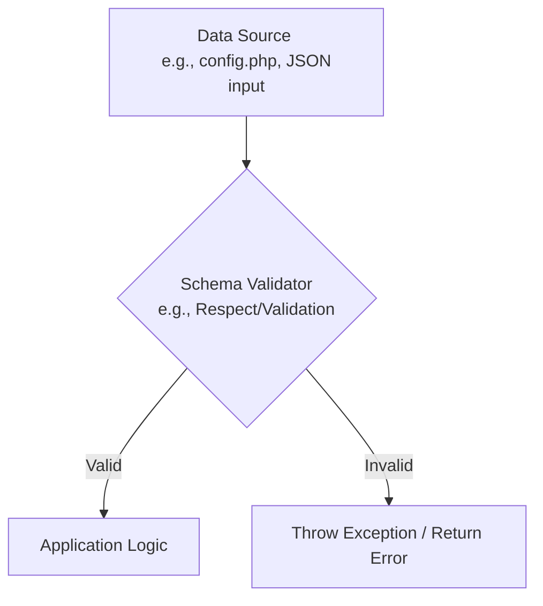
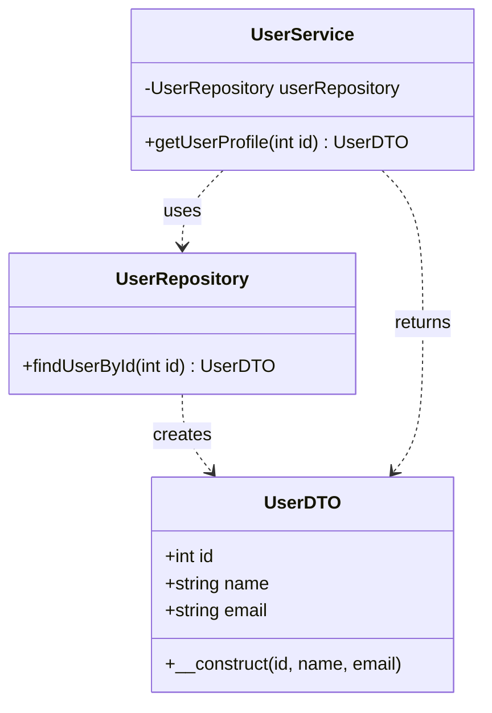
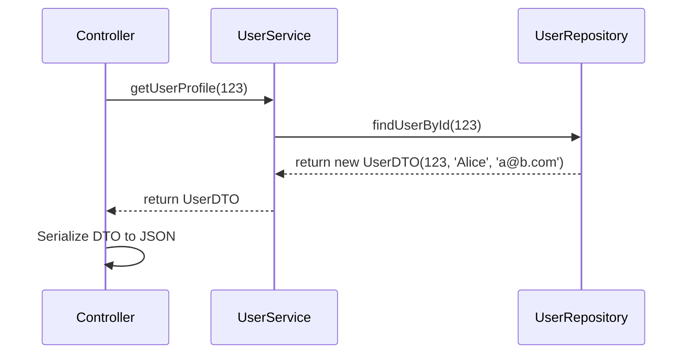

# Reference: Data Dictionaries & Data Transfer Objects (DTOs)

This document provides a comprehensive reference on the concepts, best practices, and application of Data Dictionaries and Data Transfer Objects (DTOs).

## 1. The Data Dictionary

A Data Dictionary is a centralized, authoritative source of information about data. In application development, it's our single source of truth for configuration, metadata, or schema definitions.

### Best Practices

- **Centralize It:** Keep the dictionary in one logical place (e.g., a `config/` directory). Don't spread configuration values throughout the codebase.
- **Version Control It:** The dictionary is a critical part of your application's source code. Track all changes in Git.
- **Keep it Data-Only:** The dictionary itself should just be data (arrays, YAML, JSON). It must not contain application logic.
- **Access it via an API:** Do not access the raw dictionary file directly from your business logic. Use a dedicated class (a Facade or Repository) to read from it. This decouples your logic from the storage format.
- **Document It:** Use comments or external documentation to explain the meaning, purpose, and possible values of each item in the dictionary.

### Enforcement with PHPDoc

For PHP arrays used as data dictionaries, PHPDoc `array-shape` provides schema definition and static analysis support in IDEs. It's a form of documentation that also acts as a "soft" enforcement mechanism during development.

**Structure:**

```php
/**
 * @var array<string, array{
 *   keys: list<string>,
 *   description: string,
 *   enforced: bool
 * }>
 */
$config = [
    'database' => [
        'keys' => ['host', 'port', 'username', 'password'],
        'description' => 'Credentials for the primary database.',
        'enforced' => true,
    ],
    // ... more entries
];
```

### Using a Schema Definition Library

For more robust, runtime enforcement (especially for external data like API inputs), a dedicated library is the best practice.

- **Concept:** You define the schema as a set of rules using the library's API. The library then validates your data array against these rules at runtime.
- **Separation of Concerns:** The schema definition (the rules) is separated from the validation logic (the execution).
- **Popular Libraries:** `respect/validation`, `vlucas/valitron`, `justinrainbow/json-schema-php`.

**Conceptual Flowchart:**



---

## 2. The Data Transfer Object (DTO)

A DTO is a simple object whose only purpose is to **carry data**. It acts as a structured, typed container for information moving between application layers or across networks. It contains no business logic.

### The "Universal" DTO (The Abstract Pattern)

The "universality" of a DTO isn't in a PHP `interface`, but in its **architectural pattern**. A specific `interface UserDTO` is useless because a `ProductDTO` would have completely different properties.

The universal pattern, or "abstract DTO," is a set of rules for the class itself:

1.  It is a `final` class (it's not meant to be extended).
2.  It has only `public`, typed properties.
3.  It has a `__construct` method to initialize all properties.
4.  **It has no other methods.** No logic, no behavior.

Here is the abstract pattern represented as code:

```php
/**
 * This isn't a real interface you'd implement.
 * It's a conceptual template for all DTOs.
 */
final readonly class SomeConceptDTO
{
    public function __construct(
        public type $propertyA,
        public type $propertyB,
        // ... and so on for all data you need to carry
    ) {}
}

// --- Real-world example ---
final readonly class UserProfileDTO
{
    public function __construct(
        public int $id,
        public string $name,
        public string $email,
    ) {}
}
```

### DTOs: Capabilities and Limitations

| CAN / SHOULD DO ✅                                                              | CANNOT / MUST NOT DO ❌                                                              |
| ------------------------------------------------------------------------------- | ------------------------------------------------------------------------------------ |
| Hold primitive data (`string`, `int`, `bool`)                                   | Contain business logic (`$order->calculateTotal()`)                                  |
| Hold complex data (arrays, other DTOs)                                          | Fetch their own data from a database (`$user->load()`)                               |
| Define a clear data structure (schema)                                          | Save themselves to a database (`$user->save()`)                                      |
| Provide strong type-safety                                                      | Format data for display (`$user->getFormattedDate()`)                                |
| Be easily serialized to/from JSON                                               | Contain complex validation logic                                                     |
| Be immutable (`readonly`) to ensure data integrity                              | Connect to any external service (database, API, file system)                         |

### DTOs: Application Areas

| SHOULD BE USED FOR 👍                                                           | SHOULD NOT BE USED AS 👎                                                             |
| ------------------------------------------------------------------------------- | ------------------------------------------------------------------------------------ |
| **API Responses:** Defining the exact contract for your API.                    | **Business Objects/Entities:** An object with identity and behavior (`User` entity). |
| **API Request Bodies:** Converting untrusted input into a safe, typed object.   | **A replacement for every array:** Simple, local arrays are often fine.              |
| **Between Application Layers:** Decoupling your database models from your views.  | **Configuration Loaders:** A DTO can hold config, but shouldn't load it.             |
| **Complex Function Arguments:** Grouping many arguments into a single object.     |                                                                                      |

### The `readonly` Question

**You should always default to making DTOs `readonly` (PHP 8.1+).**

This makes them **immutable**, which prevents bugs by ensuring their state cannot be changed after creation. You can pass them anywhere in your app with confidence. Only omit `readonly` if a technical limitation (like an old deserialization library) forces you to.

### Diagrams

**DTO Class Diagram**

This diagram shows how a DTO acts as a data carrier between a Repository (data layer) and a Service (logic layer).



**DTO Sequence Diagram**

This diagram shows the flow of a request where a DTO is used to transfer data.


