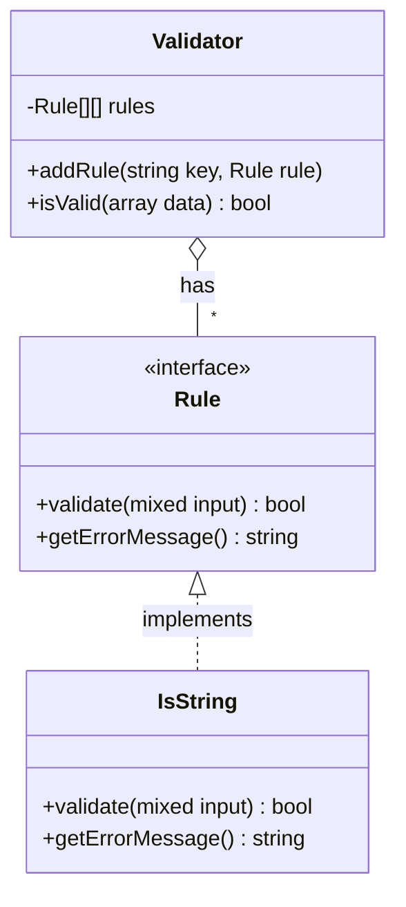
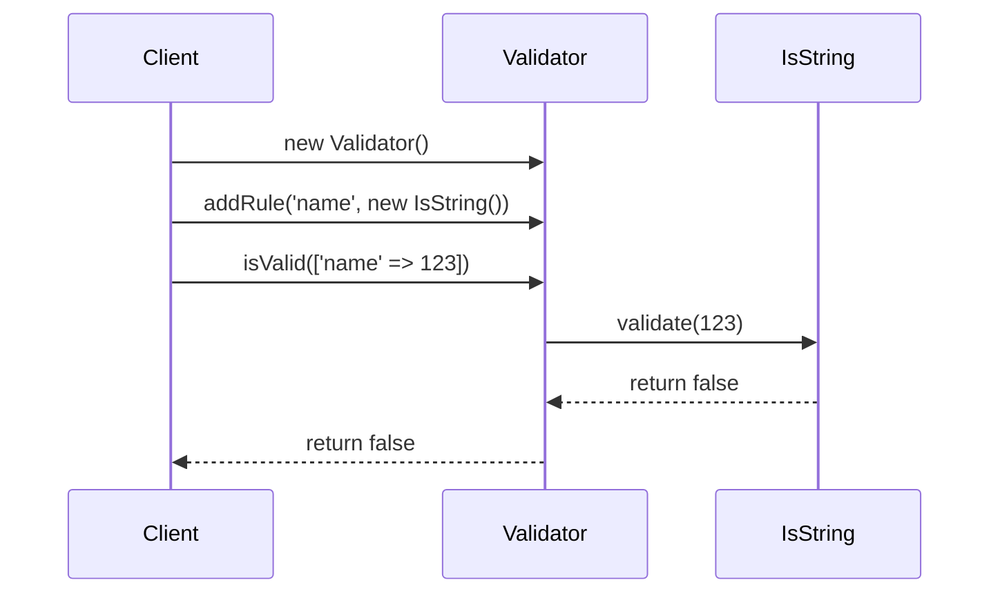

# Reference: Schema Validation Libraries

This document explains the purpose and structure of a schema validation library.

### What it is and what it does

A Schema Definition Library is a specialized tool designed for one primary purpose: **to define a set of rules for your data's structure and content, and then validate your data against those rules.**

Think of it as a blueprint and an inspector for your data.
1.  **The Blueprint (Schema Definition):** You use the library's tools to create a "blueprint" (a schema object) that describes exactly what your data should look like. For example, "the `email` field must be a valid email address," or "the `tags` field must be an array of strings."
2.  **The Inspector (Validation):** You then hand the library your actual data and the blueprint. The library acts as an inspector, comparing the data to the blueprint. It then gives you a simple pass/fail result, often with a detailed list of any violations.

This **separates the rules from the logic**. Your application code doesn't need to be littered with `if (isset($data['key']))` checks. It just asks the library, "Does this data conform to the `UserSchema`?"

### Sketch of a Simple Library

To understand the internal structure, we can imagine a simple library with two core components: a `Rule` interface and a `Validator` class that consumes them.

```php
/**
 * The contract for any validation rule.
 */
interface Rule
{
    /** Checks if the input is valid according to this rule. */
    public function validate(mixed $input): bool;

    /** The error message if validation fails. */
    public function getErrorMessage(): string;
}

// --- An example of a concrete rule ---
class IsString implements Rule
{
    public function validate(mixed $input): bool
    {
        return is_string($input);
    }

    public function getErrorMessage(): string
    {
        return 'This value must be a string.';
    }
}

/**
 * The main Validator class that uses the rules.
 */
class Validator
{
    private array $rules = [];
    private array $errors = [];

    /** Attaches a rule to a specific key in the data array. */
    public function addRule(string $key, Rule $rule): self
    {
        $this->rules[$key][] = $rule;
        return $this; // Allows for method chaining
    }

    /** Validates the data against all attached rules. */
    public function isValid(array $data): bool
    {
        $this->errors = []; // Reset errors

        foreach ($this->rules as $key => $rulesForKey) {
            if (!array_key_exists($key, $data)) {
                $this->errors[$key][] = "The key '{$key}' is missing.";
                continue;
            }

            foreach ($rulesForKey as $rule) {
                if (!$rule->validate($data[$key])) {
                    $this->errors[$key][] = $rule->getErrorMessage();
                }
            }
        }

        return empty($this->errors);
    }

    public function getErrors(): array
    {
        return $this->errors;
    }
}
```

### Diagrams

**Class Diagram**

This diagram shows the relationship between the `Validator`, the `Rule` interface, and a concrete implementation.



**Sequence Diagram**

This diagram shows the sequence of calls during a validation process.


